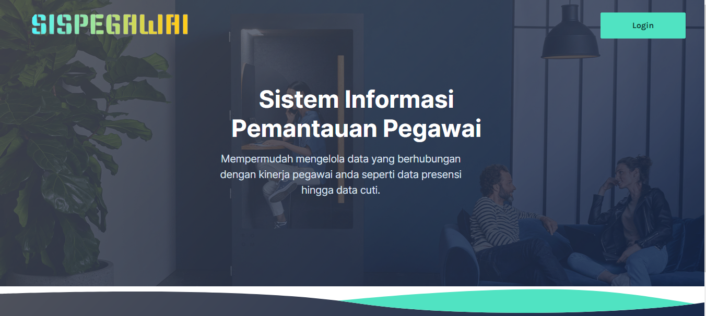
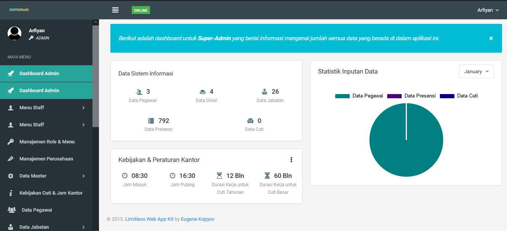
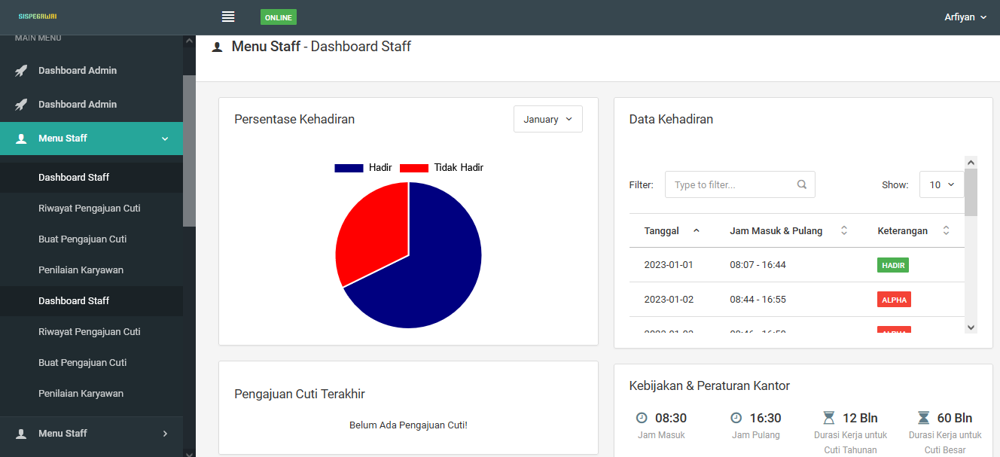
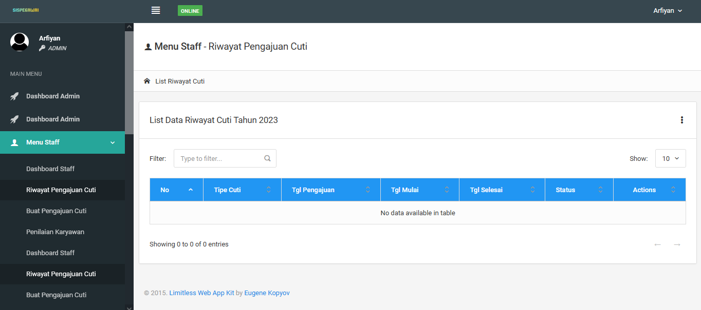
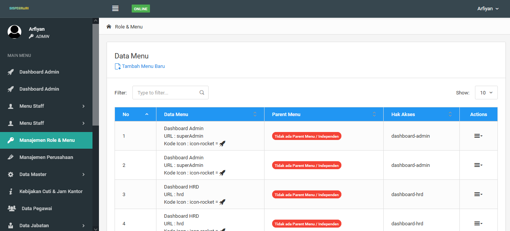
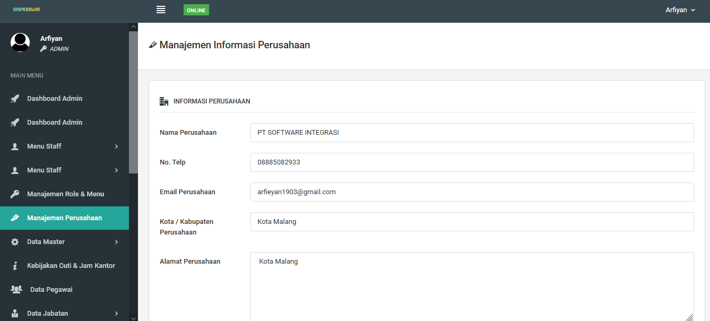
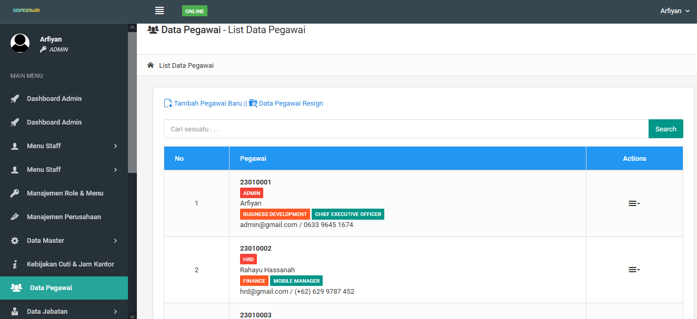
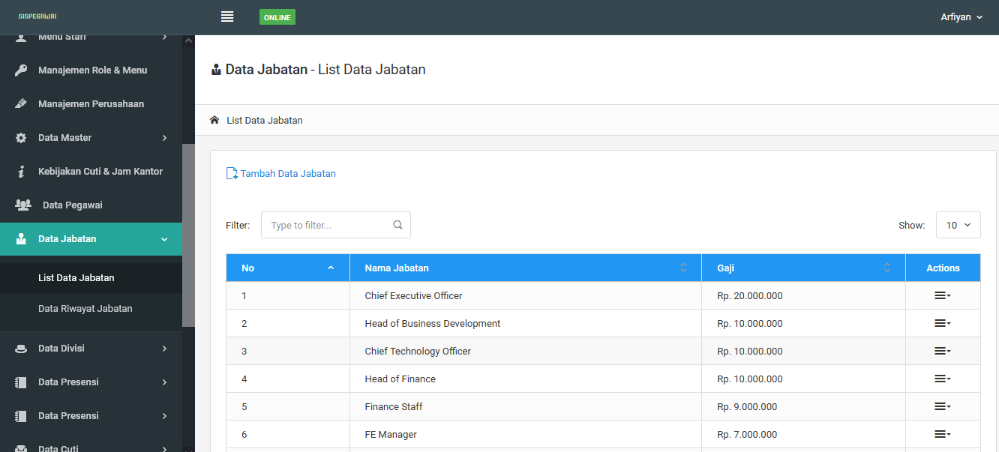
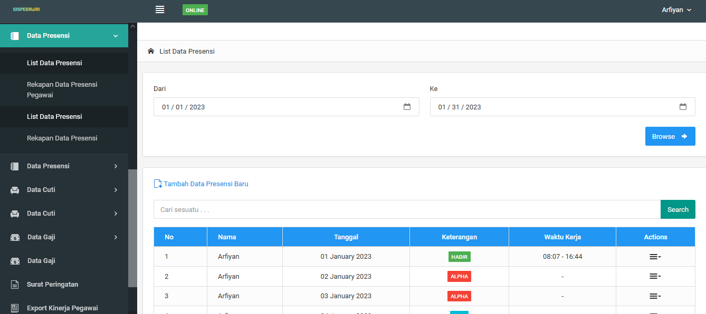
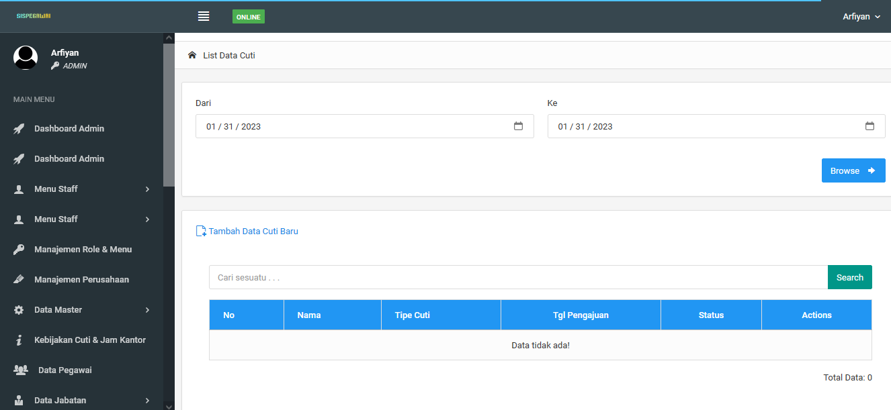

## Cara Menjalankan Project!
 

**Step Step Menjalankan Aplikasi**
1. Buka Git anda.
2. Lalu **jalankan** git clone https://github.com/Arfiyan19/Sistem-Kepegawaian.git di terminal/git bash.
3. Ganti direktori ke direktori *SIPEGAWAI*
4. Setelah itu **jalankan** composer install.
5. Lalu untuk membuat .env dengan cara **jalankan** cp .env.example .env
6. Selanjutnya salin teks yang berada di dalam **file env.txt** ke dalam file **.env**
7. Lalu selanjutnya adalah **jalankan** php artisan key:generate.
8. Lalu selanjutnya adalah **jalankan** php artisan storage:link.
9. Langkah Selanjutnya adalah **jalankan** php artisan migrate.
10. Lalu **jalankan** php artisan db:seed.
11. Setelah itu **jalankan** php artisan serve.
12. Ketikan localhost:8000 di dalam *browser*.
13. Login Sebagai Admin.
13. Masukan informasi perusahaan seperti nama perusahaan, alamat, kota, lalu no.telp, dll.

**Akun *default* Sistem**

| Akun  | Email | Pass |
| ----- | ----- | ---------|
| Admin   | admin@gmail.com  | 123456|
| HRD | hrd@gmail.com | 123456|
| Staff | staff@gmail.com | 123456|

<b>TAMPILAN APLIKASI</b>  

------LANDING PAGE -------  
   

--------- DASHBOARD ADMIN -------  
   

--------- MENU STAF -------  
   

--------- MENU STAF PENGAJUAN CUTI -------  
   

--------- MENU MANAJEMEN ROLE -------  
   

--------- MENU MANAJEMEN PERUSAHAAN -------  
   

--------- MENU KEBIJAKAN CUTI KANTOR -------  
   

--------- MENU DATA PEGAWAI -------  
   

--------- MENU JABATAN -------  
   

--------- MENU DATA DEVISI -------  
   

--------- MENU DATA PRESENSI -------  
   

--------- MENU CUTI -------  
   

--------- MENU DATA GAJI -------  
   

--------- MENU KINERJA PEGAWAI -------  
   

--------- MENU PROFILE -------  
   

